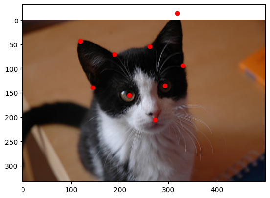
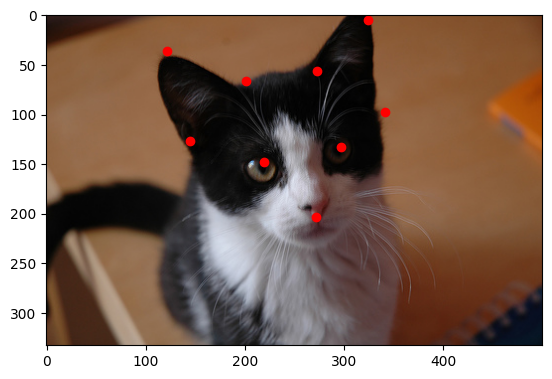

# Cat Facial Points Detection

A deep learning model designed to detect key points on cat faces using ResNet50 as the backbone with a custom detection head.

## Dataset

The dataset for this project consists of cat images with labeled facial key points.
[Dataset](https://www.kaggle.com/datasets/crawford/cat-dataset/data).
- **Images**: JPEG format.
- **Labels**: Text files with coordinates representing facial key points.

## Contents

### Model Architecture
The model is built using:
1. **ResNet50 Backbone**: Pretrained on ImageNet for feature extraction.
2. **Detection Head**:
   - **Bounding Box Regression**: Predicts the coordinates of key points.
   - **Class Prediction**: Predicts whether key points are present.

### Inference
After training, the model can be used to detect key points on new cat images. Use the `show_results` function to visualize predictions.
## Test
### Actual :

---
### Predicted

## Acknowledgements

- [ResNet50](https://keras.io/api/applications/resnet/#resnet50) for the backbone architecture.
- [OpenCV](https://opencv.org/) for image processing.
